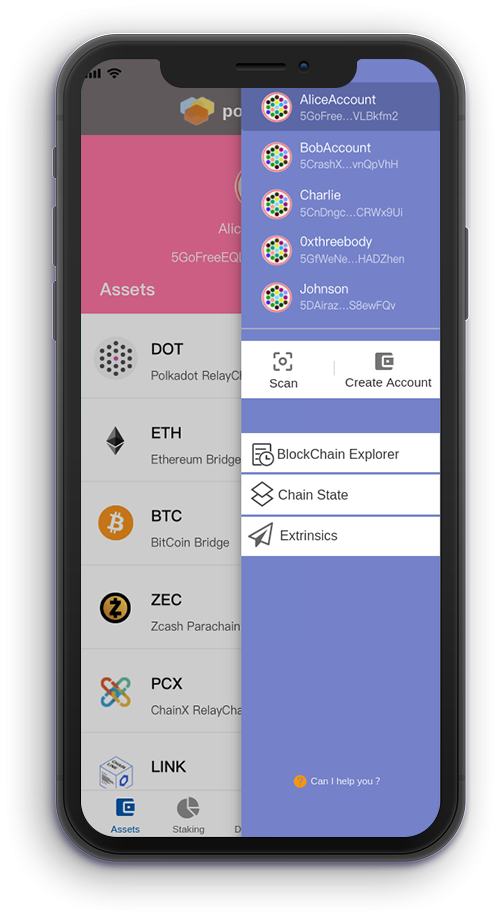
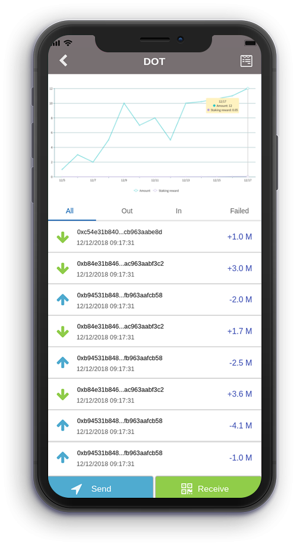
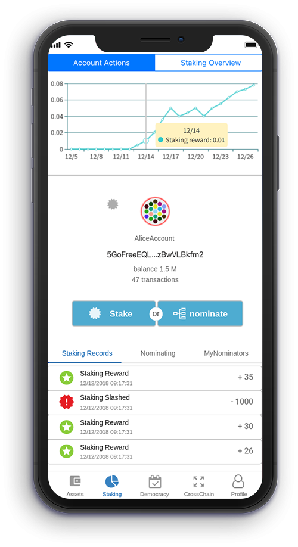
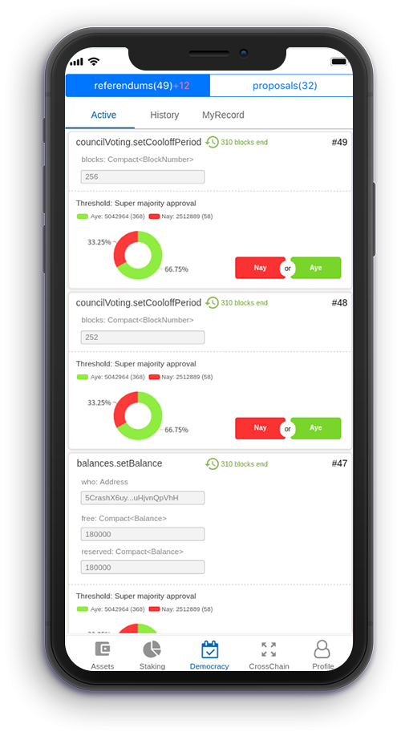
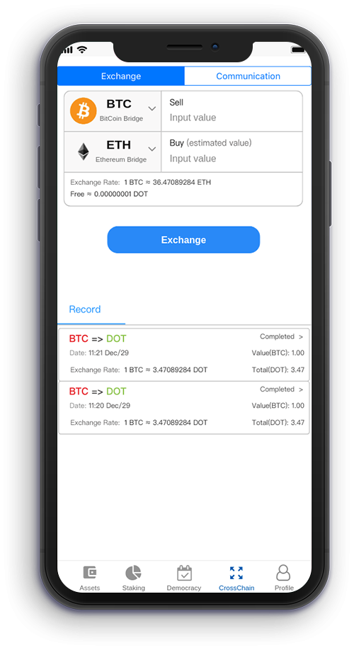

# The website of Polkawallet
Polkawallet is the mobile wallet for [Polkadot](https://polkadot.network).

Polkawallet provide Cross-chain asset one-stop management, convenient staking and governance, the private key is self-owned. 

- In order to give users a more humane and more convenient experience, as the entrance of the polkadot network, the user is provided with more intuitive visual data and status change display to guarantee the user's right to know and network participation.

- Users can add assets, support Relaychain and Parachain to transfer, receive, and view the history and state.The visual asset change analysis chart, make it easier for users to analyze assets. Users are notified when they receive the asset and can view the transfer details data.

- makes it easier for validators and nominal ators to make their contributions, by making the charts more intuitive and having a detailed history of each validators, for better analysis and research.

- provides a more intuitive and convenient entry point for participating in governance. If there is a new referendum/proposals, the user is reminded.Users can governance directly from polkawallet and view the history governance records.

- Polkawallet will follow in Polkadot footsteps and continue to expand the cross-chain ecosystem, which is a module for the near future. It will quickly integrate suitable cross-chain applications, and we believe that it will be a colorful page.

Available for all major mobile platforms. Currently react native is used as a cross-platform solution, which will be developed separately in the future.

